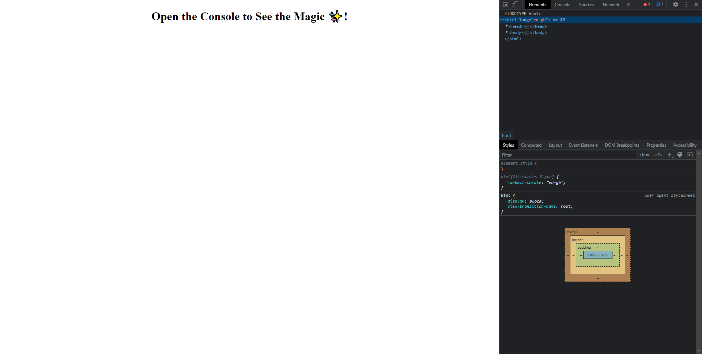

# Console-Finances

## Description
This repo is for my fourth weekly challenge. I made this using basic Javascript. In this challenge, I studied and applied all of the skills I have previously learned, alongside my newfound knowledge of JS.

## Installation

N/A

## Usage

Please visit the deployed page: https://mamaspaspa.github.io/Console-Finances/ and navigate to the inspect console.

## Credits

Referenced: The in-class mini challenges from the past week.

## License

Refer to the license outlined in this repo.